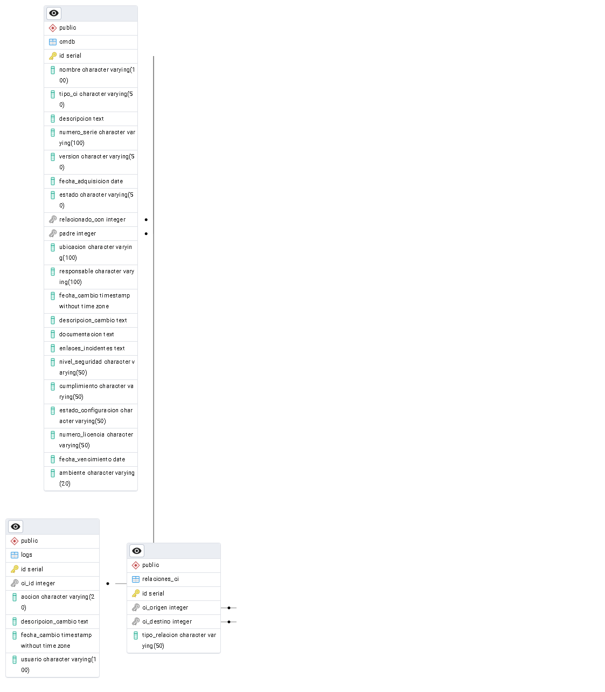

[REGRESAR](/README.md)

## MODELO DE BASE DA DATOS

**Database name: tarea3**

### Script
```
CREATE TABLE cmdb (
  id SERIAL PRIMARY KEY,
  nombre VARCHAR(100) NOT NULL,
  tipo_ci VARCHAR(50) NOT NULL,
  descripcion TEXT,
  numero_serie VARCHAR(100),
  version VARCHAR(50),
  fecha_adquisicion DATE,
  estado VARCHAR(50),
  relacionado_con INTEGER REFERENCES cmdb(id) ON DELETE SET NULL,
  padre INTEGER REFERENCES cmdb(id) ON DELETE SET NULL,
  ubicacion VARCHAR(100),
  responsable VARCHAR(100),
  fecha_cambio TIMESTAMP DEFAULT CURRENT_TIMESTAMP,
  descripcion_cambio TEXT,
  documentacion TEXT,
  enlaces_incidentes TEXT,
  nivel_seguridad VARCHAR(50),
  cumplimiento VARCHAR(50),
  estado_configuracion VARCHAR(50),
  numero_licencia VARCHAR(50),
  fecha_vencimiento DATE,
  ambiente VARCHAR(20) NOT NULL CHECK (ambiente IN ('DEV', 'QA', 'PROD'))
);

CREATE INDEX idx_cmdb_tipo_ci ON cmdb(tipo_ci);
CREATE INDEX idx_cmdb_ambiente ON cmdb(ambiente);
CREATE INDEX idx_cmdb_nombre ON cmdb(nombre);

-- Tabla para relaciones explícitas entre CIs
CREATE TABLE relaciones_ci (
  id SERIAL PRIMARY KEY,
  ci_origen INTEGER REFERENCES cmdb(id) ON DELETE CASCADE,
  ci_destino INTEGER REFERENCES cmdb(id) ON DELETE CASCADE,
  tipo_relacion VARCHAR(50) 
);

CREATE INDEX idx_rel_ci_origen ON relaciones_ci(ci_origen);
CREATE INDEX idx_rel_ci_destino ON relaciones_ci(ci_destino);

-- Tabla de logs 
CREATE TABLE logs (
  id SERIAL PRIMARY KEY,
  ci_id INTEGER REFERENCES cmdb(id) ON DELETE CASCADE,
  accion VARCHAR(20),
  descripcion_cambio TEXT,
  fecha_cambio TIMESTAMP DEFAULT CURRENT_TIMESTAMP,
  usuario VARCHAR(100) 
);

CREATE INDEX idx_logs_ci_id ON logs(ci_id);
CREATE INDEX idx_logs_fecha ON logs(fecha_cambio);
```

## Diagrama ER




[REGRESAR](/README.md)